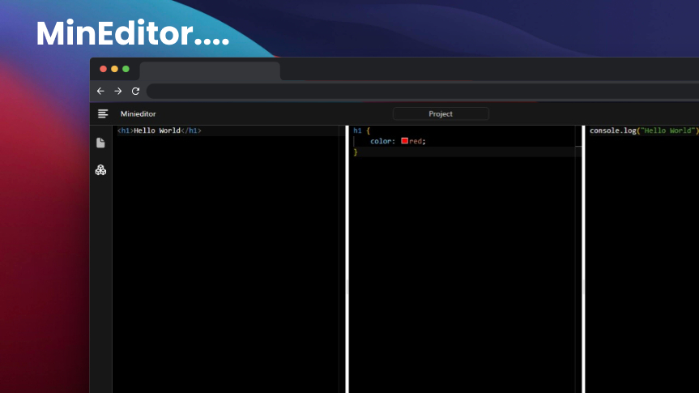

<div align="center">

# MinEditor



mineditor a HTML, CSS, JavaScript Live Editor Playground editor built with [Svelte](https://svelte.dev), [Monaco Editor](https://microsoft.github.io/monaco-editor/) and [TailwindCSS](https://tailwindcss.com).

</div>

## Developing

Once you've created a project and installed dependencies with `npm install` (or `pnpm install` or `yarn`), start a development server:

```bash
npm run dev

# or start the server and open the app in a new browser tab
npm run dev -- --open
```

## Building

To create a production version of your app:

```bash
npm run build
```

You can preview the production build with `npm run preview`.
